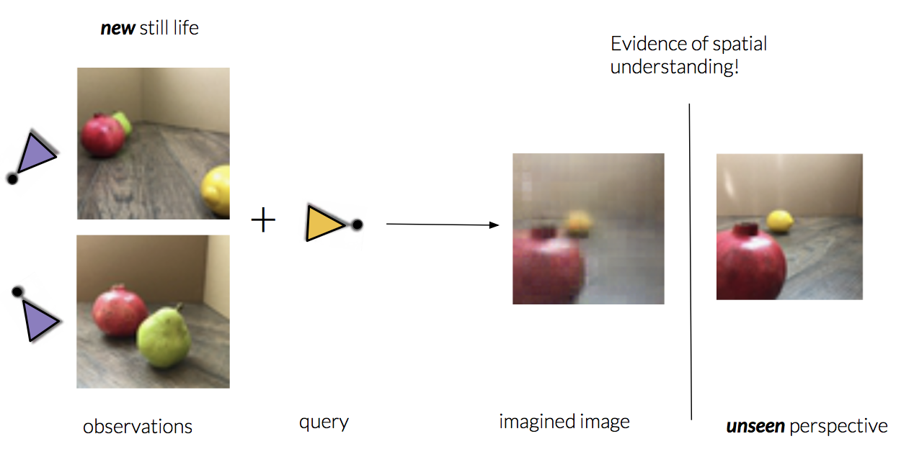

# Neural Scene Rendering
Transfer learning to render a fruit still life from photos

Author:
Brett Göhre

Slides:
https://docs.google.com/presentation/d/182KZT1Qg1rY8qnroDytn-4z5ODFjNSYkfNlwbDJAI-o/edit?usp=sharing

# Intention
To train a generative query network (Eslami, et al 2018) on real still life photos. This computer vision system predicts how a 3D scene looks from any viewpoint after just a few 2D views from other viewpoints.

The model learns to map sparse image observations of a scene to an abstract representation from which it "understands" the 3D spatial properties of the scene. At the same time, it learns to leverage this representation to "imagine" and generate images of the scene from unseen viewpoints.

# Strategy
Train on deepmind/gqn-dataset to satisfaction. Then use these learned weights the starting point for training on a new dataset found in fruit_stills_dataset.zip.

# Dataset
Photos and viewpoints collected by Brett Göhre. Novel dataset, fruit_stills_dataset.zip, is accompanied with data_iterator.py script to pair with viewpoint information.

# Training on DeepMind dataset
Visit deepmind/gqn-dataset for instructions of using gsutil cp to download dataset from google cloud storage.

python3 train_gqn_draw.py --data_dir /vol --dataset rooms_ring_camera --model_dir gqn --debug

# Training on fruit stills dataset
Replace gqn_tfr_provider.py with modified provider: __________

python3 train_gqn_draw.py --data_dir /vol --dataset rooms_ring_camera --model_dir gqn --debug

# How to use with your own dataset
Crop photos to (64, 64, 3) and collect paired viewpoints (x, y, z, sin(yaw), cos(yaw), sin(pitch), cos(pitch))

# Next steps
Feature loss & adversarial loss

Sharpens generated image. Some blur due to noise on viewpoint labels resulting in image registration problem.

# Next domains
Data efficient deep reinforcement learning

Image classification with rotated objects

Create large high resolution dataset with Blender / Unity

Transfer learning to illustrated dataset

# Acknowledgements

Many, many thanks to the DeepMind authors, Oliver Groth, and Ștefan Săftescu. Without them this 4-week project would not have been possible.

Paper:

Neural scene representation and rendering
BY S. M. ALI ESLAMI, DANILO JIMENEZ REZENDE, FREDERIC BESSE, FABIO VIOLA, ARI S. MORCOS, MARTA GARNELO, AVRAHAM RUDERMAN, ANDREI A. RUSU, IVO DANIHELKA, KAROL GREGOR, DAVID P. REICHERT, LARS BUESING, THEOPHANE WEBER, ORIOL VINYALS, DAN ROSENBAUM, NEIL RABINOWITZ, HELEN KING, CHLOE HILLIER, MATT BOTVINICK, DAAN WIERSTRA, KORAY KAVUKCUOGLU, DEMIS HASSABIS
SCIENCE15 JUN 2018 : 1204-1210

Blog:

https://deepmind.com/blog/neural-scene-representation-and-rendering/

Oliver Groth and Ștefan Săftescu's implementation:

https://github.com/ogroth/tf-gqn

